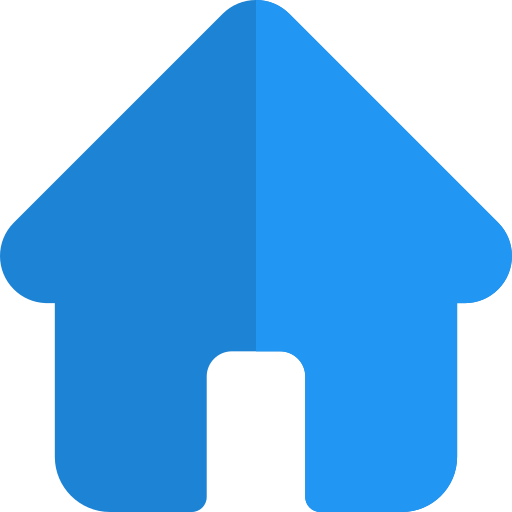

[< Pagina Inicial](../../README.md#basico)
<h1 align="center">Criando 'APP' Next.js</h1>

## Introdução

Até o momento, o aplicativo Next.js que criamos tem apenas uma página. Em geral, sites e aplicativos da web podem ter muitas páginas diferentes.

Vamos explorar como adicionar mais páginas ao nosso aplicativo.

## O que você aprenderá nesta lição

Nesta lição, você irá:

  - Criar uma nova página usando o recurso file system routing.

  - Aprender a usar o componente `Link` para ativar client-side.

  - Aprender sobre o suporte interno para divisão e pré-busca de código.

>Se você está procurando uma documentação detalhada sobre o roteamento Next.js, consulte a [documentação de roteamento](https://nextjs.org/docs/routing/introduction).

## Páginas no Next.js

No Next.js, uma página é um Componente do React exportado de um arquivo no diretório `pages`.

As páginas são associadas a uma rota com base no **nome do arquivo**. Por exemplo, em desenvolvimento:

  - `pages/index.js` está associado à `/` rota.

  - `pages/posts/first-post.js` está associado à rota `/posts/first-post`.

Já temos o arquivo pages/index.js, então vamos criar o pages/posts/first-post.js para ver como ele funciona.

## Criando uma nova página

Crie o diretório de `posts` dentro de `pages`.

Crie um arquivo chamado `first-post.js` dentro do diretório `posts` com o seguinte conteúdo:

```javascript
  export default function FirstPost() {
    return <h1>First Post</h1>
  }
```

O componente pode ter qualquer nome, mas você deve exportá-lo como uma exportação `padrão`.

Agora, verifique se o servidor de desenvolvimento está em execução e visite http://localhost:3000/posts/first-post. Você deve ver a página:

<h1 align="center"></h1>

É assim que você pode criar diferentes páginas no Next.js.

Basta criar um arquivo JS no diretório de páginas e o caminho para o arquivo se torna o caminho da URL.

De certa forma, isso é semelhante à criação de sites usando arquivos HTML ou PHP. Em vez de escrever HTML, você escreve JSX e usa React 'Components'.

Vamos adicionar um link à página recém-adicionada para que possamos navegar para ela na página inicial.

## Componente de link

Ao vincular páginas a sites, geralmente você usa a tag HTML `<a>`.

No Next.js, você usa o 'React Component' `<Link>` que envolve a marca `<a>`. `<Link>` permite que você navegue do client-side para uma página diferente no aplicativo.

## Usando `<Link>`

Primeiro, em `pages/index.js`, importe o componente `Link` do `next/link` adicionando esta linha na parte superior:

```javascript
  import Link from 'next/link'
```

Em seguida, modifique esta linha na tag `<h1>`:

```javascript
  Learn <a href="https://nextjs.org">Next.js!</a>
```

Para isso:

```javascript
  Read <Link href="/posts/first-post"><a>this page!</a></Link>
```

Em seguida, substitua o conteúdo de `pages/posts/first-post.js` pelo seguinte:

```javascript
  import Link from 'next/link'

  export default function FirstPost() {
    return (
      <>
        <h1>First Post</h1>
        <h2>
          <Link href="/">
            <a>Back to home</a>
          </Link>
        </h2>
      </>
    )
  }
```

Como você pode ver, o componente `Link` é semelhante ao uso de tags `<a>`, mas em vez de `<a href="…">`, você usa `<Link href = "…">` e insere uma tag `<a>` dentro.

Vamos verificar se funciona. Agora você deve ter um link em cada página, permitindo ir e voltar:

<h1 align="center"></h1>

## Navegação pelo 'Client-Side'

O componente `Link` permite a navegação 'client-side' entre duas páginas no mesmo aplicativo Next.js.

A navegação 'Client-side' significa que a transição da página ocorre usando JavaScript, que é mais rápido que a navegação padrão feita pelo navegador.

Aqui está uma maneira simples de verificar:

  - Use as ferramentas de desenvolvedor do navegador para alterar a propriedade CSS `background` do `<html>` para `yellow`.

  - Clique nos links para ir e voltar entre as duas páginas.

  - Você verá que o fundo amarelo persiste entre as transições de página.

Isso mostra que o navegador não carrega a página inteira e a navegação 'client-side' está funcionando.

<h1 align="center"></h1>

Se você usou `<a href="…">` em vez de `<Link href = "…">` e fez isso, a cor do background será limpa nos cliques no link, porque o navegador faz a atualização completa.

## Divisão e pré-busca de código

O Next.js faz a divisão automática do código, para que cada página carregue apenas o necessário para essa página. Isso significa que, quando a página inicial é renderizada, o código para outras páginas não é exibido inicialmente.

Isso garante que a página inicial seja carregada rapidamente, mesmo se você adicionar centenas de páginas.

Carregar apenas o código da página solicitada também significa que as páginas ficam isoladas. Se uma determinada página gerar um erro, o restante do aplicativo continuará funcionando.

Além disso, em uma versão de produção do Next.js., sempre que os componentes `Link` aparecerem na janela de exibição do navegador, o Next.js. automaticamente **pré-busca** o código da página vinculada em segundo plano. Quando você clicar no link, o código da página de destino já estará carregado em segundo plano e a transição da página será quase instantânea!

## Sumário

O Next.js otimiza automaticamente seu aplicativo para obter o melhor desempenho por divisão de código, 'client-side' e busca prévia (em produção).

Você cria rotas como arquivos em `pages` e usa o componente `Link` incorporado. Nenhuma biblioteca de roteamento é necessária.

Você pode aprender mais sobre o componente `Link` na [documentação de referência da API](https://nextjs.org/docs/api-reference/next/link) e roteamento em geral na [documentação de roteamento](https://nextjs.org/docs/routing/introduction).

>Nota: Se você precisar vincular a uma página externa fora do aplicativo Next.js., use uma tag `<a>` sem `Link`.
>Se você precisar adicionar atributos como, por exemplo, `className`, adicione-o à tag `a`, não à tag `Link`. [Aqui está um exemplo](https://github.com/zeit/next-learn-starter/blob/master/snippets/link-classname-example.js).

<h1 align="center">
<a href="../../README.md#basico">
  
  
  
</a>
</h1>

[< Pagina Inicial](../../README.md#basico)